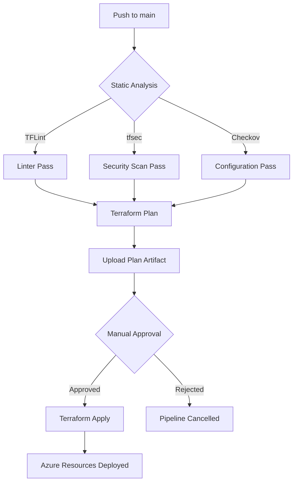

# Azure AKS & ACR Infrastructure Foundation

This repository contains Terraform code to deploy a secure and scalable Azure Kubernetes Service (AKS) cluster along with an Azure Container Registry (ACR), Virtual Network, and supporting infrastructure. The deployment is automated using a multi-stage, secure GitHub Actions pipeline.

## 🏗️ Architecture Overview

The infrastructure is modularized for reusability:
- **Resource Group:** Logical container for all resources.
- **Network:** VNet with subnets for AKS.
- **ACR:** Azure Container Registry for storing Docker images.
- **AKS:** Azure Kubernetes Service cluster integrated with ACR.

---

## 🗺️ CI/CD Workflow Diagram



## 📂 Project Structure

```text
K8S_code/
├── .github/
│   └── workflows/
│       └── deploy.yml          # Multi-stage CI/CD Pipeline
├── backend_setup/
│   └── main.tf                 # One-time setup for TF Remote Backend
├── environments/
│   └── dev/
│       ├── main.tf             # Dev Environment root module
│       ├── provider.tf         # Azure & Backend configuration
│       ├── terraform.tfvars    # Environment variables
│       └── variable.tf         # Variable declarations
├── modules/
│   ├── acr/                    # Azure Container Registry module
│   ├── aks/                    # Azure Kubernetes Service module
│   ├── network/                # VNet & Subnet module
│   └── resource_group/         # Resource Group module
├── .gitignore                  # Git ignore rules
├── .tflint.hcl                 # TFLint configuration
└── README.md                   # Documentation
```


---

## 🚀 Deployment Pipeline

The pipeline is designed with security and best practices in mind:

1.  **Security Scanning:** 
    - **TFLint:** Lints Terraform code for errors and best practices.
    - **tfsec:** Scans for security vulnerabilities.
    - **Checkov:** Checks for cloud misconfigurations.
2.  **Terraform Plan:** Generates an execution plan and saves it as an artifact.
3.  **Manual Approval:** Uses GitHub Environments (`production`) to require human approval before applying changes.
4.  **Terraform Apply:** Executes the approved plan and deploys resources to Azure.

---

## 🛠️ Setup Instructions

### 1. Azure Setup
Before running the pipeline, you need to prepare your Azure environment:

- **Create a Service Principal:**
  ```bash
  az ad sp create-for-rbac --name "aks-acr-infra-sp" --role Contributor --scopes /subscriptions/<SUBSCRIPTION_ID>
  ```
- **Register OIDC (OpenID Connect):**
  This project uses OIDC (Secret-less login) for better security.
  1. Go to **Azure Portal** > **App Registrations** > Your App.
  2. Go to **Certificates & secrets** > **Federated credentials**.
  3. Add two credentials:
     - **Branch-based:** Entity type: `Branch`, Name: `main`.
     - **Environment-based:** Entity type: `Environment`, Name: `production`.

### 2. GitHub Secrets Configuration
Go to your repository **Settings > Secrets and variables > Actions** and add the following:

| Secret Name | Description |
| :--- | :--- |
| `AZURE_CLIENT_ID` | Your Service Principal Application (Client) ID |
| `AZURE_TENANT_ID` | Your Azure Directory (Tenant) ID |
| `AZURE_SUBSCRIPTION_ID` | Your Azure Subscription ID |
| `BACKEND_AZURE_RESOURCE_GROUP` | Resource Group for Terraform State |
| `BACKEND_AZURE_STORAGE_ACCOUNT` | Storage Account name for Terraform State |
| `BACKEND_AZURE_STORAGE_CONTAINER` | Container name for Terraform State (e.g., `tfstate`) |

### 3. Manual Approval Setup
To enable manual validation:
1. Go to **Settings > Environments**.
2. Click **New environment** and name it `production`.
3. Check **Required reviewers** and add yourself.

---

## 📖 How to Use

1.  **Initialize Remote Backend:**
    Go to `backend_setup/` folder on your local machine, run `terraform init` and `terraform apply`. This will create the storage for your state file.
2.  **Add Secrets:** Add the outputs from the step above to your GitHub Secrets.
3.  **Push Code:** Push your changes to the `main` branch.
4.  **Approve:** Go to the **Actions** tab, wait for the `Plan` to complete, then review and click **Review deployments** to approve the `Apply` stage.

## 🛡️ Security
- **OIDC Authentication:** No long-lived secrets are stored in GitHub.
- **Remote State:** State is stored securely in encrypted Azure Blob Storage.
- **Scanning:** Every PR/Push is automatically scanned for security flaws.

---
Created by [ShashiSingh72](https://github.com/ShashiSingh72)
